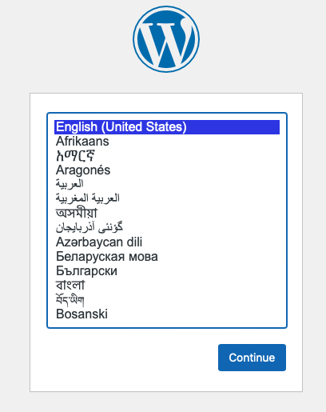
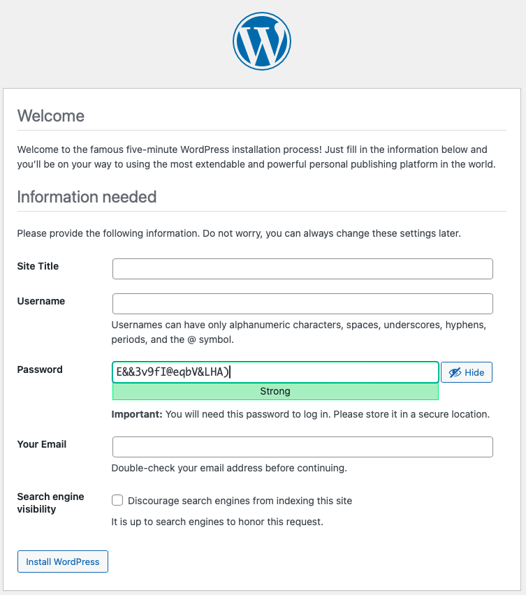

## Configuratie van WordPress
{: .text-green-100 .fs-6 }

Voordat wij aan de slag kunnen moeten wij een aantal stappen doorlopen via de installatie schermen van WordPress.
Na de installatie maak je wat demo data aan zodat je goed je configuratie kunt testen.  

---
### 1- Instellen WordPress
Open je project in de browser, waarschijnlijk deze url: [http://localhost:80](http://localhost:80)  
Je ziet nu dit scherm:  
  
Doorloop vervolgens de verschillende stappen.  
Let op dat je wel je username en wachtwoord onthoud.  
  

Na deze setup moet je misschien een paar updates uitvoeren, dat zie je in het menu item **updates**.  

---
### 2- Demo data
Maak nu minimaal 3 verschillende pagina's zodat je straks goed je site kunt testen.  
Denk hierbij aan:
- home pagina, _de welkom pagina_
- about pagina, _een mooi verhaaltje over deze website_
- contact pagina, _hier komt straks een formulier_

Het aanmaken van een pagina doe je onder het kopje `pages`.  
Plaats onder het kopje `media` 3 voorbeeld afbeeldingen die je later ergens op de site kunt gebruiken.  
De voorbeeld pagina kun je verwijderen of aanpassen.  

---
### 3- Nieuwe plugins
De huidige plugins kun je verwijderen omdat dat voorbeeld plugins zijn. ( _Akismet Anti-spam_ en _Hello Dolly_)
Installeer de volgende plugins:
#### 1- better-wp-security  
Een uitgebreide security plugin die op een simpele manier je WordPress project beveiligd.
[better-wp-security](https://wordpress.org/plugins/better-wp-security/)
[ download ](_data/better-wp-security.9.3.1.zip)

#### 2- WPForms
Een plugin om een formulier mee te maken. Als je zelf een alternatief hebt is dat ook goed.
[wpforms-lite](https://wordpress.org/plugins/wpforms-lite/)
[ download ](_data/wpforms-lite.1.8.7.2.zip)

---
### 4- Contact formulier
Activeer de form plugin en maak je eerste formulier aan.  
Ga nu naar je contact pagina en voeg dit formulier toe door het formulier te editen.  
In dit scherm kun je een nieuw element plaatsen door op het plusje te klikken en vervolgens te zoeken naar het element `form`.  
Daarna moet je het formulier selecteren.  
Vergeet niet op te slaan.  

---
### 5- Instellingen
In het settings menu zijn er een paar elementen die wij nog even moeten na lopen:
- General*, geef hier een tagline op ( sub titel )*
- Reading*, Selecteer hier je home pagina, blog pagina kun je leeg laten*
- Permalinks*, stel in dat je permalinks op basis van **Post name** wilt gebruiken* 

---
### 6- Controle
Als het goed is heb je nu ook complete website, bekijk hem maar even in je browser.

---


